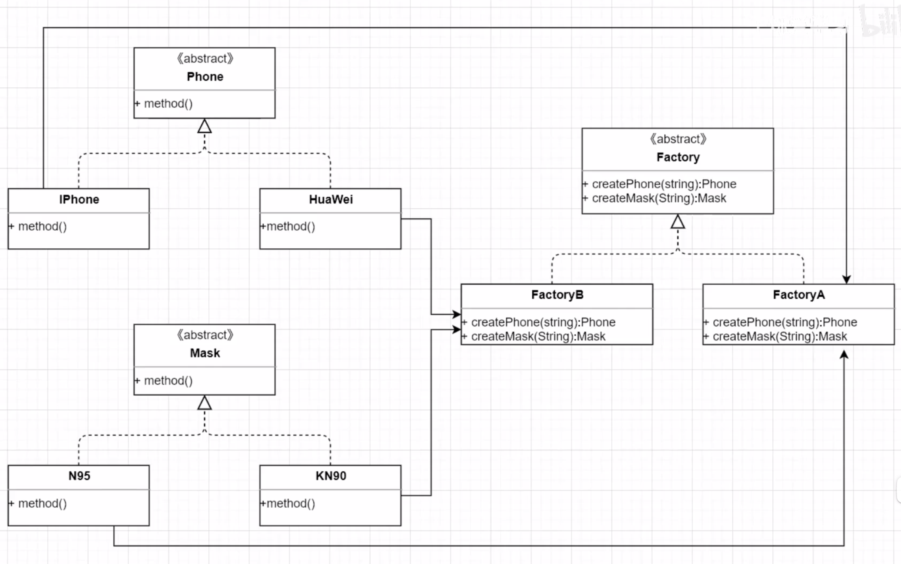

## 抽象工厂模式

因为们在工厂方法模式中定义了一个抽象的产品接口，所以我们只能生产一大类的产品。

抽象工厂模式使得这个工厂不单可以生产某一大类的产品，还可以生产其他类的产品，打破了工厂与产品一对一的关系

抽象工厂模式由四个角色组成：产品接口、产品类、工厂接口、工厂类

~~~java
//工厂接口
interface Factory{
    Phone createPhone(String str);
    Mask createMask(String str);
}

//工厂实现类
class SuperFactory implements Factory{
    public Phone createPhone(String str){
        return new iPhone();
    }
    
    public Mask createMask(String str){
        return new N95();
    }
}

//产品类---A
interface Phone{}
class iPhone implements Phone{}

//产品类---B
interface Mask{}
class N95 implements Mask{}

public class Test{
    public static void main(String[] args){
        SuperFactory factory = new SuperFactory();
        Phone phone = factory.createPhone("iPhone");
    }
}

~~~

