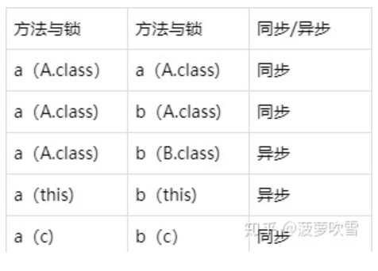

## 1.synchronized的两种使用方式

1.同步代码块锁：锁对象必须是共享资源

2.同步方法锁：如果方法是静态方法，锁对象是类名.class。如果方法是非静态方法，锁对象是this。同步方法锁中的锁对象是固定的，不能自己指定

## 2.synchronized关键字是怎么保证线程安全的

在Java中，所有的对象都有一把锁，叫内置锁，也称作监视器锁，这是一种排他锁（一个线程获取后，其他线程只能等待其释放后，才有机会获得该锁）

Java中的每个对象都可以把内置锁当作同步锁来使用，当一个线程在进入synchronized代码块之前，会自动获取到监视器锁，此时其他线程在访问synchronized代码块时，就会被堵塞挂起。拿到锁的线程会在执行完成、抛出异常、调用wait()方法时释放锁，其他线程只能等待锁被释放后才能获取该锁

原理：

## 3.sleep()和wait()的区别

sleep()是Thread类中的静态方法，时间指定不指定都可以，到点自己醒，释放线程的执行权，不释放锁对象

wait()是Object类中的方法，时间指定不指定都可以，一定要唤醒，释放线程执行权和锁对象

线程同步：若干程序不可以同时执行，当某一个线程处于运行状态时，其他线程一定处于就绪或者阻塞状态。

线程异步：若干程序可以同时执行，他们之间不存在相互影响，当一个线程处于运行状态时，其他线程也可以运行。

## 4.多线程加锁的方式

- synchronized关键字

  synchronized关键字可以帮助我们给一个类对象或者实例对象加锁。常见的使用方法为同步方法锁和同步代码块锁。当加在方法上时，如果该方法是静态方法，则锁住的是类对象；如果该方法是非静态方法，则锁住的是实例对象。当加在代码块上时，要看给的参数是什么，如果是***.class，则锁住的是类对象，如果是this或者某个实例，则锁住的是当前实例对象或指定的实例对象。

  被锁定的代码块只有拿到锁定的对象（钥匙）之后，才可以执行

  联系到锁，若干线程同步的条件之一是，他们要执行的方法或代码块使用了同样的锁对象。假设类A，有a、b两个线程使用了synchronized关键字，c是类A的一个静态变量

  

- Lock

  Lock是另一种帮助加锁的机制。使用Lock时，需要一个Lock对象（lock）。通过调用lock中的lock、unlock方法，为某段代码加锁。使用lock时，判断多个线程是同步或异步，判断依据是所用的lock是不是同一个对象，是即为同步，不是即为异步。

## 5.锁的种类

