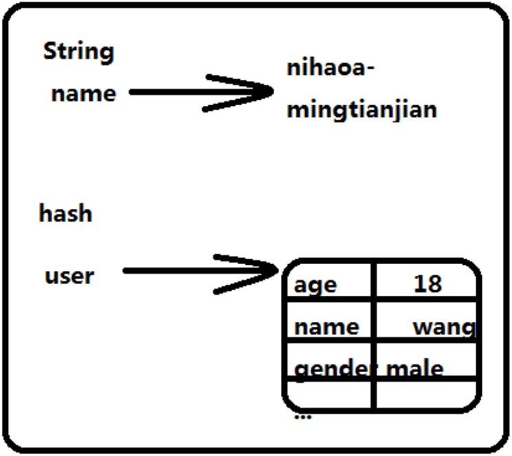

雪崩：由于缓存使用，减少了大量访问数据库的需求。这时如果有海量请求，缓存技术可以支持海量高并发，一旦缓存数据丢失（内存运行），丢失量不大，数据库承受请求的压力，丢失量过大的话，数据库无法承受涌入的请求压力造成系统崩溃。即使数据库重启，请求未消失，数据库仍然无法承受，只要缓存数据不恢复，系统就不能用---缓存雪崩

持久化：可以做到只要持久化文件不破坏，就能在启动的时候加载，将缓存数据大量的恢复到内存中---高效的解决容灾

## redis五种数据结构：

1. String：存储临时数据：排号数组、在线人数等

2. hash：面向数据对象的结构，可以存储对应数据属性的内容，底层是个双层map

   

3. list：双向链表，低配版的消息队列

4. set：元素值不能重复的集合对象，应用：兴趣爱好，共同好友

5. zse：有序的元素值不能重复的集合对象，热搜、热播、排行榜

