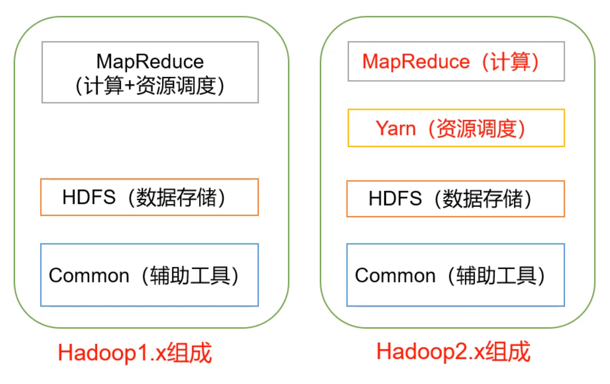
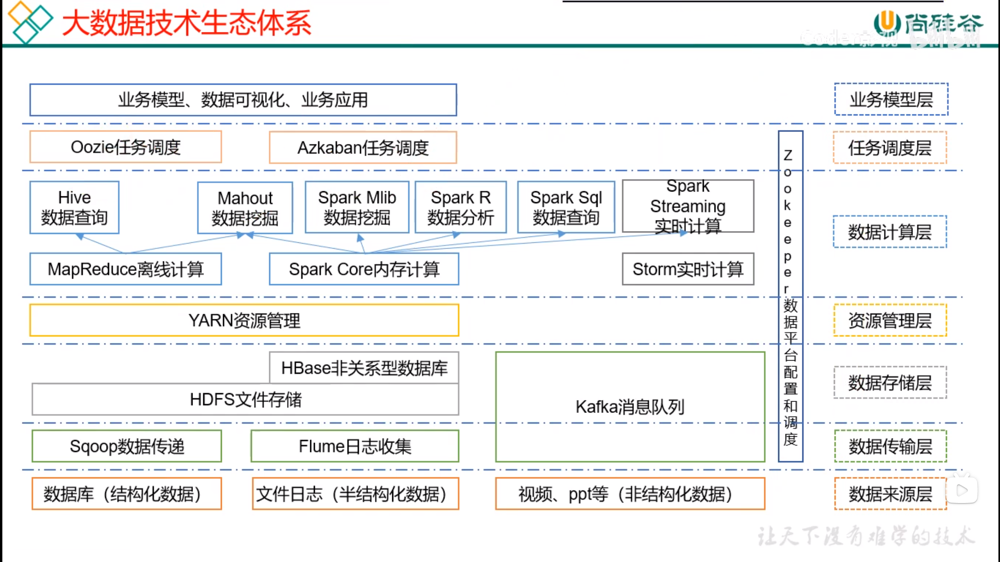

Hadoop是什么：

- Hadoop是一个分布式系统基础架构
- Hadoop生态圈

HDFS：存数据、很多机器一起存

MapReduce：算、很多机器一块算

Hadoop优势：

- 高可靠性：Hadoop底层维护多个数据副本，所以

Hadoop组成：

HDFS架构概述：

- NameNode（nn）：索引，存储文件的元数据，如文件名、文件目录结构，文件属性（生成时间、副本数、文件权限），以及每个文件的块列表和所在的DataNode等，只有一份
- DataNode（dn）：真正的数据，多份
- Seconday NameNode（2nn）：nn的助手，用来监控HDFS状态的辅助后台程序，每隔一段时间获取HDFS元数据的快照

元数据：描述数据的数据

YARN架构：

