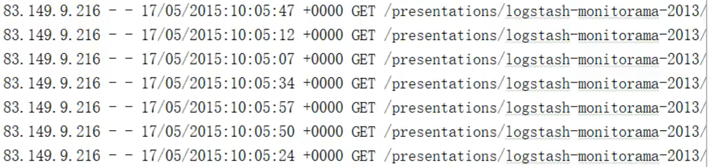

groupBy

将数据根据指定的规则进行分组，分区默认不变，但是数据会被打乱重新组合，我们将这样的操作称之为shuffle。

分组和分区没有必然的联系

~~~scala
val rdd : RDD[Int] = sc.makeRDD(List(1,2,3,4),2)

//groupBy会将数据源中的每一个数据进行分组判断，根据返回的分组key进行分组
//相同的key值的数据会被放在同一组中

def groupFunction(num:Int):Int = {
    num % 2 
}

val groupRDD : RDD[Int, Iterable[Int]] = rdd.groupBy(groupFunction)

groupRDD.collect().foreach(println)

~~~

~~~scala
//相同的首写字母放到同一组中
val rdd : RDD[Int] = sc.makeRDD(List("Hello","Spark","Scala","Hadoop"),2)

//groupBy会将数据源中的每一个数据进行分组判断，根据返回的分组key进行分组
//相同的key值的数据会被放在同一组中

val groupRDD = rdd.groupBy(_.charAt(0))

groupRDD.collect().foreach(println)
~~~

对上述日志，按小时时间段分组，计算每小时访问的次数

~~~scala
val rdd : RDD[Int] = sc.textFile("datas/apache.log")

val timeRDD : RDD[String, Iterable[(String, Int)]] = rdd.map(
	line => {
        val datas = line.split(" ")
        val time = datas(3)
        //time.substring(0, time.indexOf(":"))
        val sdf = new SimpleDateFormat("dd/MM/yyyy:HH:mm:ss")
        val date: Date = sdf.parse(time)
        //date.getHours()
        val sdf1 = new SimpleDateFormat("HH")
        val hour: String = sdf1.format(date)
        (hour, 1)
    }
).groupBy(_._1)

timeRDD.map{
    case ( hour, iter) => {
        (hour, iter.size)
    }
}.collect.foreach(println)

~~~

