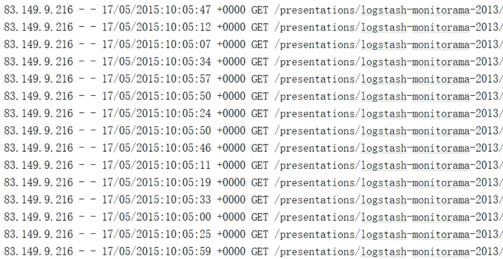

filter

将数据根据指定的规则进行筛选过滤，符合规则的数据保留，不符合规则的数据丢弃

当数据进行少选过滤后，分区不变，但是分区内的数据可能不均衡，生产环境下，可能会出现数据倾斜

~~~scala
val rdd = sc.makeRDD(List(1,2,3,4))

val filterRDD: RDD[Int] = rdd.filter(num => num%2 != 0)

filterRDD.collect().foreach(println)

sc.stop()

~~~

获取apache.log中2015年5月17日的请求路径

~~~scala
val rdd = sc.textFile("datas/apache.log")

rdd.filter(
	line => {
        val datas = line.split(" ")
        val time = datas(3)
        times.startWith("17/05/2015")
    }
).collect().foreach(println)

sc.stop()
~~~
