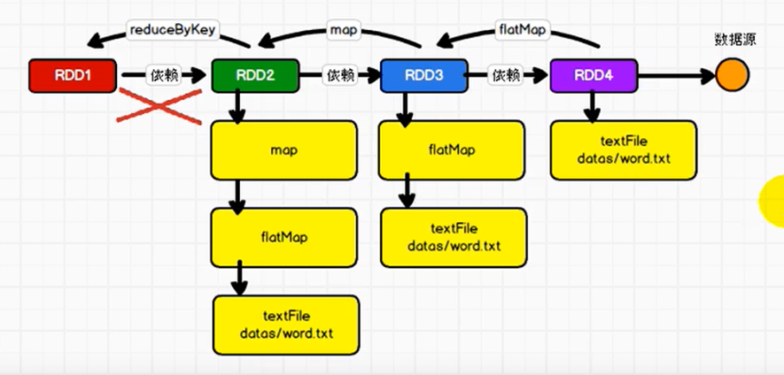

RDD不会保存数据

RDD为了提供容错性, 需要将RDD间的关系保存下来

一旦出现错误, 可以根据血缘关系将数据源重新读取进行计算

- 窄依赖

  新的RDD的一个分区的数据依赖于旧的RDD一个分区的数据. 这个依赖称之为OnToOne依赖 ( 窄依赖 ) 

- 宽依赖

  新的RDD的一个分区的数据依赖于旧的RDD多个分区的数据. 这个依赖称之为Shuffle依赖 ( 宽依赖 )